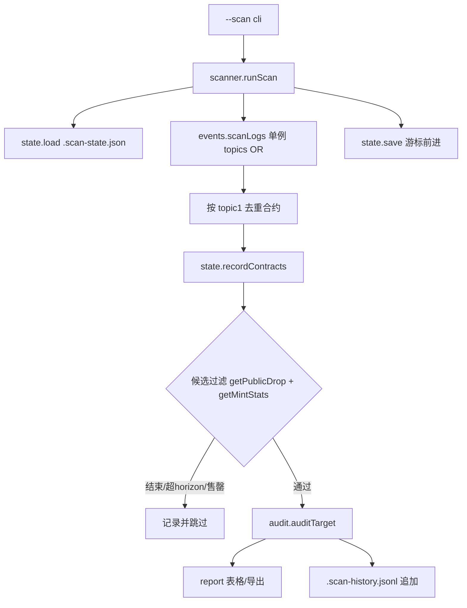

# 技术设计: 发现器 `--scan`（M2）

## 技术方案

### 核心技术
- TypeScript / Node 18+；不引入新依赖（复用 `audit/events` 的窗口扫描与重试、`audit/audit` 的审计、`audit/report` 的渲染与导出）
- 存储：`.scan-state.json`（原子写）+ `.scan-history.jsonl`（追加）

### 实现要点

- **发现主题**（SeaDrop 单例，一次扫描同时拉两类事件）：
  - `topics[0]` OR：`PublicDropUpdated`（配置出现/变更）、`SeaDropMint`（有铸造活动）
  - `topics[1]` = nftContract（两个事件的第一个参数均为 indexed 合约地址）
- **游标**：`cursorBlock` 从 0 开始；每次扫描 `from = cursor + 1`，`to = latest − CONFIRMATIONS`（`CONFIRMATIONS = 64`）；扫描完成后 `cursor = to`（重复区间仅用于容错）。
- **首次回看**：无游标时 `from = latest − sinceDays × 86400 / blockTimeSec`；`blockTimeSec` 用 `estimateBlockTime()` 现测并写入状态。
- **候选过滤**（每个发现合约 2 次 `eth_call`，3 并发）：`fetchPublicDrop` 存在、`endTime > now`、`startTime ≤ now + horizonHours`、`fetchMintStats(0x0)` 未售罄。任一不满足记入状态（售罄写 `soldOutAtBlock`），不进入审计。
- **重审策略**：新合约必审；已知合约在 `lastSeenBlock > lastAuditedBlock`（有新事件）或"开售在 horizon 内且距上次审计超过 30 分钟"时重审。售罄合约仅在出现新事件后才重新检查（供应可被提高）。
- **审计参数**：scan 触发的审计用 `lookbackDays = 1`（Arc 7 天 = 23.7 万窗口级别不可接受），CLI 的 `--lookback-days` 可覆盖。
- **限流**：候选检查与审计串行、`--limit`（默认 20）封顶单次审计数；发现结果先落盘再审计，崩溃不丢发现。

## 架构设计



## 架构决策 ADR

### ADR-13: 发现主题用 OR 一次扫描，而不是逐个合约轮询
**上下文:** SeaDrop 单例承载全部 drop 的配置与铸造事件；逐个 token 扫描需要先知道 token 列表。
**决策:** 在单例上以 `topics[0] = [PublicDropUpdated, SeaDropMint]` 一次扫描，`topic1` 即合约地址。
**理由:** 一次请求覆盖全部 drop；两类事件互补（只有配置事件的新 drop 与只有铸造活动的旧 drop 都能发现）。
**替代方案:** 监听 `DropURIUpdated` 等更多事件 → 拒绝原因: 与公售可执行性无关，徒增数据量。
**影响:** 若未来出现非单例的 SeaDrop 变体，需要单独接入。

### ADR-14: 状态用 JSON + 原子写，JSONL 追加快照
**上下文:** 计划明确不引入 `better-sqlite3`（原生编译破坏 Windows 一键安装）。
**决策:** `.scan-state.json` 保存游标与合约状态（原子写：临时文件 + rename）；`.scan-history.jsonl` 追加审计快照。
**理由:** 数据量级小（每天数百合约），JSON 足够；无新依赖、可人工查看与修复。
**替代方案:** `node:sqlite` → 拒绝原因: 需要 Node 22+，与项目声明不符。
**影响:** 无 SQL 查询；M3 看板如需复杂聚合再评估。

### ADR-15: 确认延迟与"发现先落盘"
**上下文:** Robinhood 10 块/秒、Arc 2 块/秒，reorg 窗口虽小但存在；扫描后立即审计耗时可观。
**决策:** 游标只前进到 `latest − 64`，并先把发现结果写入状态再执行审计。
**理由:** 64 块在两条链上分别约 6s / 33s，足以覆盖常见 reorg；先落盘保证中断不丢发现。
**替代方案:** 扫到 latest 再回退 → 拒绝原因: 容易在重启后越过未确认事件。
**影响:** 新 drop 的可见延迟增加数秒到半分钟，对提前数小时开售的目标无影响。

## API设计

### `runScan(opts, hooks?): Promise<ScanReport[]>`
- **请求:** `{ chains: string[], sinceDays: number, horizonHours: number, limit: number, lookbackDays: number, audit: boolean, statePath: string, historyPath: string, cacheDir?: string }`
- **响应:** 每链 `{ chainKey, fromBlock, toBlock, windows, discovered, newContracts, candidates, skipped: { ended, far, soldOut, notApplicable }, audited: AuditResult[] }`

### 纯函数（可单测）
- `discoveryTopics(): string[]` —— 主题 OR 列表
- `isCandidateDrop(drop, nowSec, horizonHours): boolean`
- `shouldAudit(entry, eventSinceAudit, startAtMs, nowMs, horizonMs, reauditMs): boolean`
- `advanceCursor(state, chainKey, toBlock, blockTimeSec, at)`
- `recordContracts(state, chainKey, contracts, at)`

### CLI
- `npm start -- --scan [--chain robinhood,arc] [--since-days 1] [--horizon-hours 72] [--limit 20] [--lookback-days 1] [--grade A,B] [--export <path>] [--force] [--quantity N] [--max-price <eth|current>] [--json] [--no-audit]`

## 数据模型

```jsonc
// .scan-state.json
{
  "version": 1,
  "chains": {
    "arc": { "cursorBlock": 21283000, "blockTimeSec": 0.51, "updatedAt": "2026-09-17T07:55:00Z" }
  },
  "contracts": {
    "arc": {
      "0x5f26…b751": {
        "firstSeenBlock": 21270000, "lastSeenBlock": 21282990,
        "lastAuditedBlock": 21282990, "lastAuditedAt": "2026-09-17T07:55:00Z",
        "lastGrade": "A", "soldOutAtBlock": null
      }
    }
  }
}
```

```jsonc
// .scan-history.jsonl （每行一条）
{ "at": "2026-09-17T07:55:00Z", "chain": "arc", "contract": "0x5f26…", "grade": "A", "remaining": "8905", "projected": "7366", "start": 1758124800 }
```

## 安全与性能
- **安全:** 只读链上调用；状态文件不含私钥/API key；`.gitignore` 忽略状态与历史；`--export` 复用 M1 的 `--force` 防覆盖。
- **性能:** 增量扫描每次仅数个窗口；候选过滤 3 并发；`--limit` 封顶审计数；审计使用 1 天回看与 5 分钟缓存。

## 测试与部署
- **单元测试（`tests/scan.cjs`）:** 游标推进（首次/增量/确认延迟）、`isCandidateDrop` 边界（恰好结束/恰好 horizon）、`shouldAudit`（新合约/有新事件/临近开售刷新/售罄后无事件不审）、状态读写与损坏回退。
- **真链冒烟:** `--scan --chain arc --since-days 0.05 --limit 2`（Arc 活跃度高，2 个窗口即可发现候选）；`--scan --chain robinhood --since-days 0.2 --limit 2`。
- **回归:** `npm run build` + `node --test tests/*.cjs`（现有 35 例不得回归）。
- **部署:** 本地 CLI；建议 `--scan` 由 cron/定时任务每 10–30 分钟跑一次（增量成本极低）。
