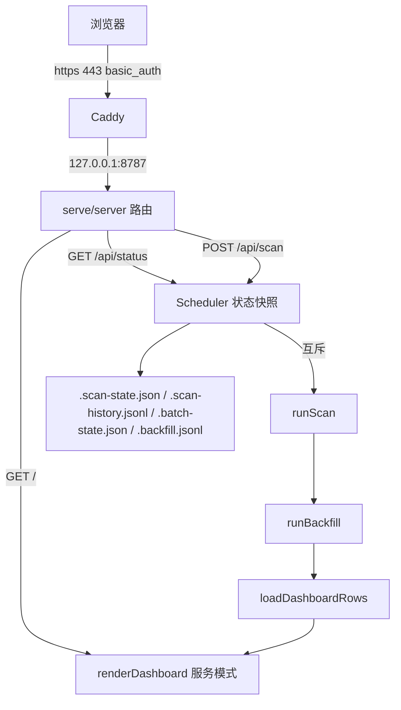

# 技术设计: 数据侧服务化 M4a（常驻调度 + 公网看板）

## 技术方案

### 核心技术
- Node 内置 `http`（零新依赖，保持 4 个纯 JS 依赖与 Windows 一键安装）；复用 `runScan` / `runBackfill` / `loadDashboardRows` / `renderDashboard` / `loadState` / `loadHistory` / `loadLedger` / `loadBackfill`
- 部署：systemd（低权限用户）+ Caddy（自动 HTTPS + basic_auth + 安全头），服务只绑 `127.0.0.1`

### 环境加载（安全关键）

`src/index.ts` 目前在任何分支之前执行 `dotenv.config(.env)`。改为：

```
const args = process.argv.slice(2);
const serve = args.includes("--serve");
if (serve) {
  dotenv.config({ path: process.env.SERVE_ENV_FILE ?? ".env.serve" });   // 不存在时静默跳过
  assertNoPrivateKeys(process.env);   // 非空即抛错，进程退出
} else {
  dotenv.config({ path: ".env" });
}
```

`assertNoPrivateKeys` 在 `src/serve/config.ts` 导出，单测覆盖。

### 模块结构

```
src/serve/
  config.ts     serveConfig(env) 解析 SERVE_*/SCAN_*；assertNoPrivateKeys(env)
  scheduler.ts  Scheduler：互斥 tick、状态快照、日志环形缓冲、rows 缓存
  server.ts     createServer(...) / runServe()：路由、JSON、限流、Origin 校验
```

### 调度器

```ts
export class Scheduler {
  rows: DashboardRow[] = [];
  readonly status: SchedulerStatus;
  constructor(private opts: SchedulerOptions) {}
  start(): void           // 立即 tick 一次 + setInterval(tick, intervalMs)
  stop(): void
  async tick(trigger: "timer" | "manual"): Promise<boolean>  // 互斥；返回是否真正执行
}
```

单轮顺序：`runScan({ chains, includeMints, sinceDays, horizonHours, limit, lookbackDays, audit: true, statePath, historyPath, cacheDir })` → `runBackfill(loadLedger(ledgerPath), { ledgerPath, file: backfillPath })` → `loadDashboardRows(loadState(statePath).state, loadHistory(historyPath), loadLedger(ledgerPath), undefined, loadBackfill(backfillPath))`。

- 日志：`log(line)` 写入环形缓冲（保留最近 200 行，带 ISO 时间），并 `console.log` 交给 journald
- 状态：`{ running, lastScanAt, nextScanAt, lastError, lastReports, backfill, log }`；`/api/status` 做脱敏后输出
- 失败：捕获并写 `lastError`，进程不退出

### 路由

| 方法 / 路径 | 行为 | 安全 |
|---|---|---|
| `GET /healthz` | `{ ok: true }` | 供 Caddy/systemd 探活 |
| `GET /` | `renderDashboard(rows, meta, { serve: true })` | 只读 |
| `GET /api/status` | 状态 + 日志尾部 + 各链游标 | 脱敏：RPC URL 用 `maskRpc`，不返回文件路径 |
| `GET /api/rows?chain=&grade=` | 行数据（服务端过滤） | 只读 |
| `POST /api/scan` | 触发一轮 | 仅 `application/json`、Origin 同源、5 秒节流、运行中 409 |
| 其他 | 404 JSON | — |

### 服务模式看板（html.ts）

新增可选参数 `renderDashboard(rows, meta, opts?: { serve?: boolean })`：
- `serve: true` 时在标题下插入状态条与 "Scan now" 按钮，并注入一段轮询脚本（15 秒拉 `/api/status`，更新文字；按钮 POST `/api/scan` 后提示）
- 其余表格、筛选、排序、短名单、净值列不变；`<meta refresh 300>` 保留
- 动态字段仍全部 `escapeHtml`

## 架构设计



## 架构决策 ADR

### ADR-19: 单进程内置 http + 内置调度器，不引入 Web 框架与 cron
**上下文:** 需要"常驻扫描 + 页面 + 手动触发"；仓库坚持零额外依赖与 Windows 可用。
**决策:** Node 内置 `http` + `setInterval`；扫描互斥由调度器保证。
**替代方案:** cron + 静态托管 → 无法手动触发/导出，状态文件可能被并发写坏；Express/Fastify → 引入依赖树。
**影响:** 路由与静态资源都要手写（本阶段只有 6 个路由，可接受）。

### ADR-20: 服务进程与私钥物理隔离（不加载 .env + 启动断言）
**上下文:** 附件方案称"不调用 `walletKeysFromEnv` 即安全"，但入口会无条件加载 `.env`，密钥仍会进入进程环境。
**决策:** `--serve` 只加载 `.env.serve`；启动时断言环境无 `PRIVATE_KEY(S)`，否则拒绝启动。
**替代方案:** 仅靠代码不读取 → 拒绝原因: 环境里仍存在密钥，进程被攻破即泄露，且审计无法证明。
**影响:** 部署需要两个 env 文件；执行侧继续用 `.env`。

### ADR-21: Caddy 终止 TLS，服务只绑 127.0.0.1
**上下文:** 用户只开放 80/443，公网访问。
**决策:** `SERVE_HOST=127.0.0.1`，Caddy 自动证书 + basic_auth + 安全头；8787 不对公网开放。
**替代方案:** SSH 隧道 → 用户明确不用；直接暴露 8787 → 无 TLS/认证，拒绝。
**影响:** 需要域名与 80/443；无域名时文档给 `tls internal` 自签方案。

### ADR-22: POST 以 JSON content-type + Origin 校验替代 CSRF token
**上下文:** 无会话 cookie（basic_auth），但浏览器会自动附带凭据，仍有 CSRF 面。
**决策:** 强制 `content-type: application/json`（跨站表单不可达）+ 校验 `Origin` 与请求 Host 同源；不发 CORS 头。
**替代方案:** 引入 CSRF token/session → 需要状态管理，收益不足。
**影响:** 非浏览器客户端（curl/脚本）需自行设置 JSON 头，文档说明。

## 安全与性能
- **安全:** 服务无密钥（断言 + 测试）；只读路由不写盘；`/api/status` 脱敏；POST 限流 5 秒；`SERVE_HOST` 默认 127.0.0.1；Caddy 加 `Strict-Transport-Security`、`X-Content-Type-Options`、`X-Frame-Options`。
- **性能:** 页面每次请求实时渲染（几百行字符串拼接，毫秒级）；调度器一轮扫描与 CLI 相同；状态接口读内存快照，无 IO。

## 测试与部署
- **单元/集成测试（`tests/serve.cjs`）:** `assertNoPrivateKeys`（无密钥通过、有密钥抛错）、`serveConfig`（默认值与覆盖）、`createServer` 起在随机端口后用 `fetch` 验证：`/healthz` 200、`/api/status` 脱敏（不含 `PRIVATE`/RPC 密钥/绝对路径）、`POST /api/scan` 带 JSON 触发一次且第二次 409、错误 content-type 返回 415、Origin 不同返回 403、未知路径 404。
- **本地冒烟:** `SCAN_CHAINS=arc SCAN_LIMIT=1 SCAN_LOOKBACK_DAYS=0.05 SERVE_PORT=8790 npm start -- --serve` → `curl /healthz`、`curl /api/status`、`curl /` 确认页面含行与状态条；确认 `ps eww` 或启动日志中无 `PRIVATE_KEY`。
- **部署验收（用户执行）:** systemd 启动 → `journalctl -u nft-serve -f` 看到首轮扫描开始/结束 → 浏览器 `https://<域名>/` 输入 basic_auth 后看到候选表与状态条。
- **回归:** `npm run build` + `node --test tests/*.cjs`（现有 66 例不得回归）。
