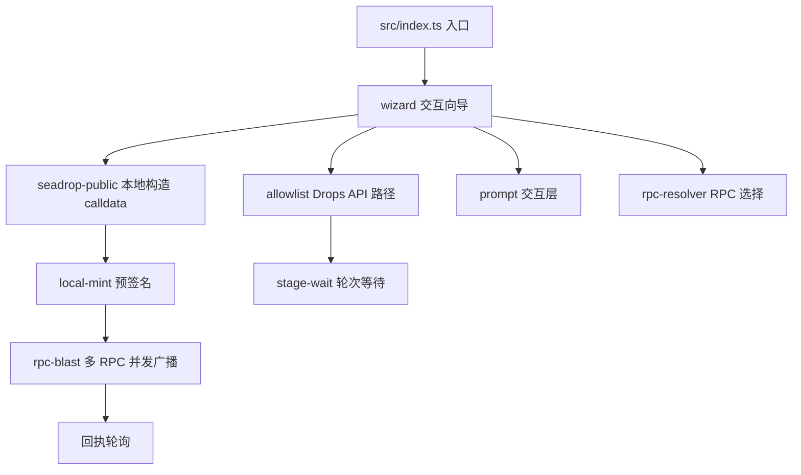
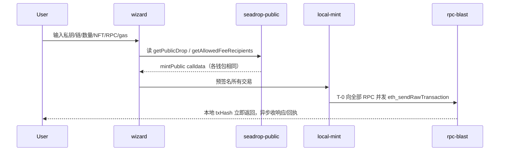

# 架构设计

## 总体架构

## 技术栈
- **后端:** TypeScript / Node.js 18+（单进程 CLI）
- **链上:** ethers 6（签名、ABI 编码）
- **依赖:** chalk（彩色输出）、dotenv（配置）、ora（倒计时 spinner）

## 核心流程

## 重大架构决策
完整的ADR存储在各变更的how.md中，本章节提供索引。

| adr_id | title | date | status | affected_modules | details |
|--------|-------|------|--------|------------------|---------|
| ADR-1 | 文案中文化但不改时区语义（保留 UTC+7） | 2026-09-14 | ✅已采纳 | 全部模块 | [history/2026-09/202609141442_zh-cn-i18n/how.md](../history/2026-09/202609141442_zh-cn-i18n/how.md) |