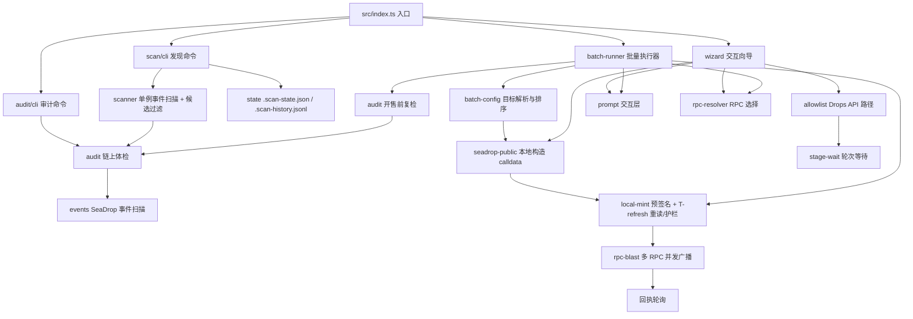
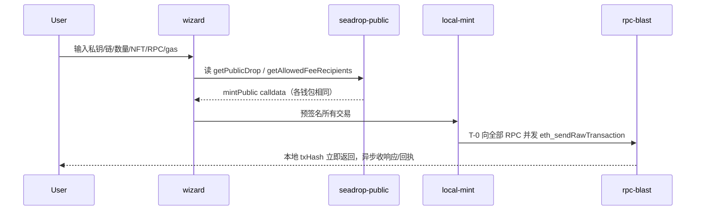

# 架构设计

## 总体架构

## 技术栈
- **后端:** TypeScript / Node.js 18+（单进程 CLI）
- **链上:** ethers 6（签名、ABI 编码）
- **依赖:** chalk（彩色输出）、dotenv（配置）、ora（倒计时 spinner）

## 核心流程

## 重大架构决策
完整的ADR存储在各变更的how.md中，本章节提供索引。

| adr_id | title | date | status | affected_modules | details |
|--------|-------|------|--------|------------------|---------|
| ADR-1 | 文案中文化但不改时区语义（保留 UTC+7） | 2026-09-14 | ✅已采纳（后被 ADR-3 取代时区部分） | 全部模块 | [history/2026-09/202609141442_zh-cn-i18n/how.md](../history/2026-09/202609141442_zh-cn-i18n/how.md) |
| ADR-2 | CLI 英文化、文档保持中文 | 2026-09-14 | ✅已采纳 | 全部模块 | [history/2026-09/202609141521_cli-en/how.md](../history/2026-09/202609141521_cli-en/how.md) |
| ADR-3 | 时区由 UTC+7 切换为 UTC+8 | 2026-09-14 | ✅已采纳 | time-format/wizard/stage-wait | [history/2026-09/202609141521_cli-en/how.md](../history/2026-09/202609141521_cli-en/how.md) |
| ADR-4 | 多目标串行单队列，不做并行 | 2026-09-15 | ✅已采纳 | batch | [history/2026-09/202609151934_batch-timed-mint/how.md](../history/2026-09/202609151934_batch-timed-mint/how.md) |
| ADR-5 | 配置复用 .env，targets.json 只列目标 | 2026-09-15 | ✅已采纳 | batch/rpc-resolver/keys | [history/2026-09/202609151934_batch-timed-mint/how.md](../history/2026-09/202609151934_batch-timed-mint/how.md) |
| ADR-6 | 签名推迟到 T-3s 并重读+重锚 startTime | 2026-09-15 | ✅已采纳 | local-mint/batch | [history/2026-09/202609151934_batch-timed-mint/how.md](../history/2026-09/202609151934_batch-timed-mint/how.md) |
| ADR-7 | 批量模式复用向导按键流程而非复制 | 2026-09-15 | ✅已采纳 | batch/wizard | [history/2026-09/202609151934_batch-timed-mint/how.md](../history/2026-09/202609151934_batch-timed-mint/how.md) |
| ADR-8 | 审计优先于发现（M1 先于 M2） | 2026-09-17 | ✅已采纳 | audit | [history/2026-09/202609171426_target-audit/how.md](../history/2026-09/202609171426_target-audit/how.md) |
| ADR-9 | 链上为主判据，OpenSea 为可选增强 | 2026-09-17 | ✅已采纳 | audit | [history/2026-09/202609171426_target-audit/how.md](../history/2026-09/202609171426_target-audit/how.md) |
| ADR-10 | headroom 用实测铸造曲线而非名额公式 | 2026-09-17 | ✅已采纳 | audit/events | [history/2026-09/202609171426_target-audit/how.md](../history/2026-09/202609171426_target-audit/how.md) |
| ADR-11 | 不引入原生依赖存储（JSON 缓存） | 2026-09-17 | ✅已采纳 | audit/cache | [history/2026-09/202609171426_target-audit/how.md](../history/2026-09/202609171426_target-audit/how.md) |
| ADR-12 | M1.5 接入 batch-runner，fail-open | 2026-09-17 | ✅已采纳 | batch/audit | [history/2026-09/202609171426_target-audit/how.md](../history/2026-09/202609171426_target-audit/how.md) |
| ADR-13 | 发现主题用 OR 一次扫描（单例不是逐合约） | 2026-09-17 | ✅已采纳 | scan/events | [history/2026-09/202609171557_scan-discovery/how.md](../history/2026-09/202609171557_scan-discovery/how.md) |
| ADR-14 | 状态用 JSON 原子写 + JSONL 快照，不用 SQLite | 2026-09-17 | ✅已采纳 | scan/state | [history/2026-09/202609171557_scan-discovery/how.md](../history/2026-09/202609171557_scan-discovery/how.md) |
| ADR-15 | 确认延迟 64 块 + 发现先落盘再审计 | 2026-09-17 | ✅已采纳 | scan | [history/2026-09/202609171557_scan-discovery/how.md](../history/2026-09/202609171557_scan-discovery/how.md) |